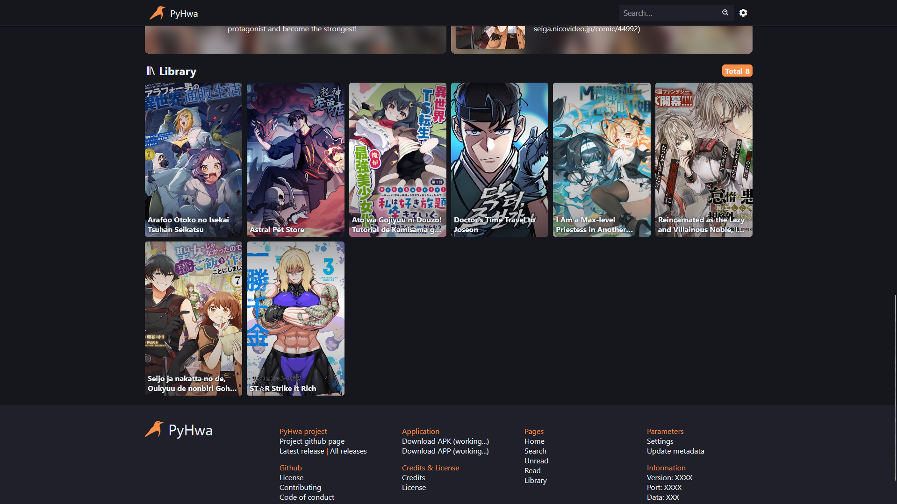

<div align="center">
    
    <h3>PyHwa</h3>
    <p><em>PyHwa is a lightweight Python application for reading manhwa, manhua, and manga across devices on your local network. It offers seamless viewing, tracks your reading progress, and allows customization with multiple themes.</em></p>
</div>

> [!NOTE]
> The use of HakuNeko is highly recommended for rapid organization.

## Features
- Automatically displays content for playback
- Keeps track of where you stopped
- Keeps track of your theme choices
- Displays in Manhwa or Manga mode (and remembers)
- Records where you stopped
- Responsive (coming soon)
- User-friendly (coming soon)
- pleasant interface (coming soon)
- multiple themes (coming soon)
- Automatic metadata search (still in development phase)
- Automatic retrieval of manhwa/manhua/manga information

### Preview
#### Computer
<div align="center">




</div>

#### Phone
<div align="center">


</div>


## How to install

> [!NOTE]
> You need to have Python (for the server) and NodeJS (for the front-end) installed on your machine!

### Quick installation

### Manual installation
1. Clone repository
    ```sh
    git clone https://github.com/kerogs/PyHwaer.git
    ```
1. Installing NPM packages *(at the root and in the static folder)*
    ```sh
    npm i;cd static; npm i
    ```
1. download python requirements
    ```sh
    pip 
    ```


## How to use
### With exe
* Click on the file ``start_server.exe``.
### With CLI
```sh
py .\app.py
```

## How to add manhwa/manhua/manga
Everything must be put in the ``/static/content`` folder.

You must respect this tree structure for it to work properly
- ``/static/content/[manga]/[chapter]/[allImage]``

Example :
```tree
📦content
 ┣ 📂Arafoo Otoko no Isekai Tsuhan Seikatsu
 ┃ ┣ 📂Chapter 1
 ┃ ┃ ┣ 📜01.jpg
 ┃ ┃ ┣ 📜02.jpg
 ┃ ┃ ┣ 📜03.jpg
 ┃ ┃ ┣ 📜04.jpg
 ┃ ┃ ┣ ...
 ┃ ┣ 📂Chapter 2
 ┃ ┃ ┣ 📜01.jpg
 ┃ ┃ ┣ 📜02.jpg
 ┃ ┃ ┣ 📜03.jpg
 ┃ ┃ ┣ 📜04.jpg
 ┃ ┃ ┗ ...
 ┃ ...
 ┗ 📜 .gitkeep
```

> [!NOTE]
> For the chapter numbering, you can name it as you wish, but it's highly recommended to keep to the format used in the example for the moment.

## Configuration file
The configuration file is located in the root directory and is called ``pyhwa.ini``.

### default configuration
* port = 5113
* allow_local_network = true
* server_requires_login = true (not currently in use)
* admin_requires_login = true (not currently in use)
* auto_meta_source = mangadex (only mangadex for the moment)
* index_autometa = true
* data_path = static/content (not support change for the moment)
* meta_path = static/meta (not support change for the moment)
* logs_enable = false (recommend to keep false)

## Future updates to come.
- More themes.
- Able to record where you stop (scroll for manhwa and image for manga)
- Modification directly on the site