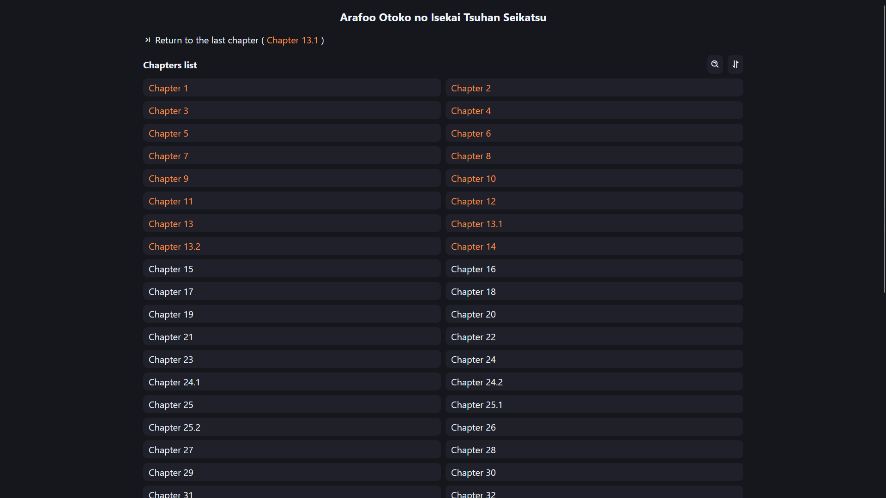

<div align="center">
    
    <h3>PyHwa</h3>
    <p><em>PyHwa is a lightweight Python application for reading manhwa, manhua, and manga across devices on your local network. It offers seamless viewing, tracks your reading progress, and allows customization with multiple themes.</em></p>
</div>

> [!NOTE]
> The use of HakuNeko is highly recommended for rapid organization.

## Features
- Automatically displays content for playback
- Keeps track of where you stopped
- Keeps track of your theme choices
- Displays in Manhwa or Manga mode (and remembers)
- Records where you stopped
- Responsive (coming soon)
- User-friendly (coming soon)
- pleasant interface (coming soon)
- multiple themes (coming soon)
- Automatic metadata search (still in development phase)
- Automatic retrieval of manhwa/manhua/manga information

### Preview
#### Computer
<div align="center">


</div>

#### Phone
<div align="center">


</div>


## How to install
1. Clone repository
    ```sh
    git clone https://github.com/kerogs/PyHwaer.git
    ```
1. Installing NPM packages *(at the root and in the static folder)*
    ```sh
    npm i;cd static; npm i
    ```
1. download python requirements
    ```sh
    pip 
    ```


## How to use
### With CLI
```sh
py .\app.py
```

## How to add manhwa/manhua/manga
Everything must be put in the ``/static/`` folder.

You must respect this tree structure for it to work properly
- ``/static/[manga]/[chapter]/[allImage]``

> [!IMPORTANT]
> For the moment, the program can only recognize images, not compressed files, etc.

Example :
```tree
📦content
 ┣ 📂Arafoo Otoko no Isekai Tsuhan Seikatsu
 ┃ ┣ 📂Chapter 1
 ┃ ┃ ┣ 📜01.jpg
 ┃ ┃ ┣ 📜02.jpg
 ┃ ┃ ┣ 📜03.jpg
 ┃ ┃ ┣ 📜04.jpg
 ┃ ┃ ┣ ...
 ┃ ┣ 📂Chapter 2
 ┃ ┃ ┣ 📜01.jpg
 ┃ ┃ ┣ 📜02.jpg
 ┃ ┃ ┣ 📜03.jpg
 ┃ ┃ ┣ 📜04.jpg
 ┃ ┃ ┗ ...
 ┃ ...
 ┗ 📜 .gitkeep
```

> [!NOTE]
> For the chapter numbering, you can name it as you wish, but it's highly recommended to keep to the format used in the example for the moment. The same goes for image format.

## Future updates to come.
- Add everything in an exe file to avoid using commands
- Better Design
- More themes.
- Cover image support
- Display a “not yet read” section
- Make it possible to access the site from a phone.
- Able to record where you stop (scroll for manhwa and image for manga)
- GUI interface for start and stop server